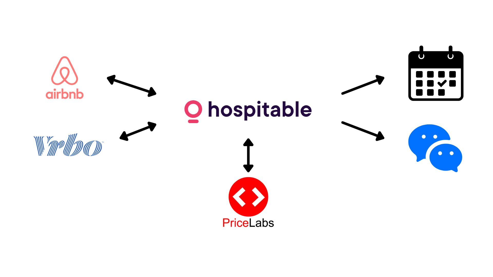

# 
<h5>Directory</h5> 

<b>[Tech Portfolio Home](https://github.com/Jays1115/Jalen-Smith.git)</b>

# Suite Xperience - IT Architecture Explained

  
Visualization of the IT Architecture for Suite Xperience  

<h2>The Challenges This Architecture Solves</h2>
At the start of this business, the founders aimed to automate many of the repetitive tasks to create a more passive, hands-off operation that both the founder and his son could easily manage. They sought to streamline various processes, including managing calendars across multiple online travel agencies (OTAs), automating guest communication, sending notifications to cleaning staff, optimizing pricing for their rental units, and setting up reminders for upcoming bookings. By automating these key tasks, the business could operate more efficiently, allowing the founders to focus on growth and long-term strategy while reducing the need for constant manual intervention.

<h2>The Solution</h2>
Implemented hosting of a static web page using Amazon S3, ensuring improved performance, scalability, and reliability. Configured the S3 bucket for static website hosting, enabled public access, and integrated appropriate permissions for secure and seamless operation. This solution optimized user access to real-time wave size predictions while reducing downtime and maintenance overhead.

<h2>Program walk-through:</h2>

Navigating to the S3 Section within AWS. AWS has already populated the S3 instances needed for this lab:  

 
 
